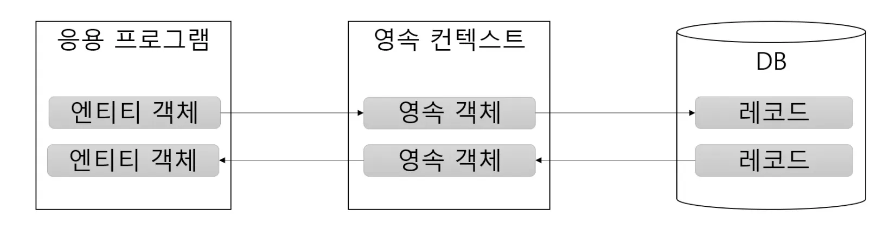

### REST API란?
- HTTP URI(Uniform REsource Identifier)를 통해 자원(Resource)을 명시하고,
- HTTP Method(POST, GET, PUT, DELETE, PATCH 등)를 통해
- 해당 자원(URI)에 대한 CRUD Operation을 적용하는 것을 의미한다.

### CRUD Operation이란?
- CRUD는 대부분의 컴퓨터 소프트웨어가 가지는 기본적인 데이터 처리 기능인 Create(생성), Read(읽기), Update(갱신), Delete(삭제)를 묶어서 일컫는 말

- REST에서의 CRUD Operation 동작 예시
  Create: 데이터 생성(POST)
  Read: 데이터 조회(GET)
  Update: 데이터 수정(PUT, PATCH)
  Delete: 데이터 삭제(DELETE)

### REST 구성요소
1. Server-Client(서버-클라이언트 구조)
2. Stateless(무상태)
3. Cacheable(캐시 처리 기능)
4. Layered System(계층화)
5. Uniform Interface(인터페이스 일관성)

### REST의 장단점
#### 장점
- HTTP 프로토콜의 인프라를 그대로 사용하므로 REST API 사용을 위한 별도의 인프라를 구축할 필요가 없다.
- HTTP 프로토콜의 표준을 최대한 활용하여 여러 추가적인 장점을 함께 가져갈 수 있게 해준다.
- HTTP 표준 프로토콜에 따르는 모든 플랫폼에서 사용이 가능하다.
- Hypermedia API의 기본을 충실히 지키면서 범용성을 보장한다.
- REST API 메세지가 의도하는 바를 명확하게 나타내므로 의도하는 바를 쉽게 파악할 수 있다.
- 여러 가지 서비스 디자인에서 생길 수 있는 문제를 최소화한다.
- 서버와 클라이언트의 역할을 명확하게 분리한다.

#### 단점
- 표준이 자체가 존재하지 않아 정의가 필요하다.
- HTTP Method 형태가 제한적이다.
- 브라우저를 통해 테스트할 일이 많은 서비스라면 쉽게 고칠 수 있는 URL보다 Header 정보의 값을 처리해야 하므로 전문성이 요구한다.
- 구형 브라우저에서 호환이 되지 않아 지원해주지 못하는 동작이 많다.(익스플로어)

### Object Relational Mapping, 객체-관계 매핑
- 객체와 관계형 데이터베이스의 데이터를 자동으로 매핑(연결)해주는 것을 말한다.
    - 객체 지향 프로그래밍은 클래스를 사용하고, 관계형 데이터베이스는 테이블을 사용한다.
    - 객체 모델과 관계형 모델 간에 불일치가 존재한다.
    - ORM을 통해 객체 간의 관계를 바탕으로 SQL을 자동으로 생성하여 불일치를 해결한다.

### JPA 특징
- 어노테이션을 이용한 매핑 설정
- String, int, LocalDate 등 기본적인 타입에 대한 매핑 지원
- 커스텀 타입 변환기 지원
    내가 만든 Money 타입을 DB칼럼에 매핑 가능
- 밸류 타입 매핑 지원
- 클래스 간 연관 지원: 1-1, 1-N, N-1, N-M
- 상속에 대한 매핑 지원

### 영속 컨텍스트(PERSISTENCE CONTEXT)

EntityManager 단위로 영속 컨텍스트 관리
커밋 시점에 영속 컨텍스트의 변경 내역을 DB에 반영

#### 기본 구조
- EntityManagerFactory 초기화
- DB 작업이 필요할 때마다
    - EntityManager 생성
    - EntityManager로 DB 조작
    - EntityTransaction으로 트랜잭션 관리
하지만 스프링과 연동할 때에는 대부분 스프링이 대신 처리하므로 매핑 설정 중심으로 작업
- 영속 컨텍스트
    - 엔티티를 메모리에 보관
    - 변경을 추적해서 트랜잭션 커밋 시점에 DB에 반영