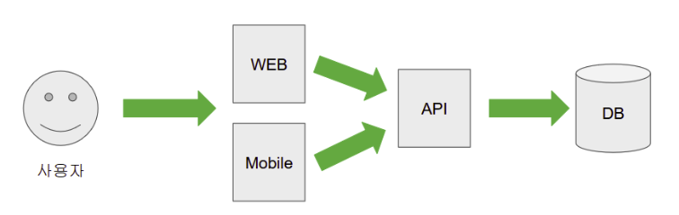

### Swagger란?
- 사용하는 이유
  여러명에서 개발하는 웹 서비스에서 단일 프로젝트가 DB에서 데이터를 가져오고, 화면을 그려주고, 회원정보를 저장하는 등 모든 것을 담당하지 않는다.
  
  
  
  못해도 이와 같은 형태를 유지한다.
- 처음 개발하거나 혹은 유지보수를 진행중인 경우 해당 API서버가 어떤 Spec을 가진 데이터를 주고 받는지에 대한 문서 작업이 꼭 필요하다.
- 하지만 문서 작업은 시간이 많이 들고, 매번 기능이 추가되거나 변경될 때마다 작업하는데 불편하기 때문에 자동화 할 수 있도록 만든것이 swagger이다.

- HTTP API(REST)의 명세(schema)를 표준화해서 문서화하고, UI로 테스트(try-it)할 수 있게 해주는 도구 세트
- 서버에 있는 REST API들을 HTML 화면으로 노출해주는 툴이라고 생각하면 된다.
- 핵심 로직은 swagger-ui가 담당하고 Spring에서 핵심 로직을 활용해서 더 잘 쓸 수 있게 해주는 라이브러리는 springdoc-openapi이다.

- @Operation : 해당 API에 대한 정보
- @ApiResponses : Response에 대한 정보로 여러개의 @ApiResponse를 가지고 있다.
- @ApiResponse: response 코드와 설명을 설정
- @Parameter: 파라미터에 대한 정보

### API란?
- API (Application Programming Interface, 응용 프로그램 프로그래밍 인터페이스)는 응용 프로그램에서 사용할 수 있도록,
  운영 체제나 프로그래밍 언어가 제공하는 기능을 제어할 수 있게 만든 인터페이스를 뜻한다.

### 어노테이션 관련 공부
- @RequiredArgsConstructor는 초기화 되지않은 final 필드나, @NonNull 이 붙은 필드에 대해 생성자를 생성해 준다.

### DTO = Data Transfer Object (데이터 전달용 객체)
- 프로세스 간에 데이터를 전달하는 객체를 의미합니다. 말 그대로 데이터를 전송하기 위해 사용하는 객체라서 그 안에 비즈니스 로직 같은 복잡한 코드는 없고 순수하게 전달하고 싶은 데이터만 담겨있습니다.
- DTO는 순수하게 데이터를 저장하고, 데이터에 대한 getter, setter 만을 가져야한다고 한다.

#### DTO를 사용하는 주된 이유
1. 데이터 노출 제어 및 보안 강화: 엔티티(Entity) 객체를 그대로 클라이언트에 반환하면, 엔티티의 모든 필드가 노출되어 민감한 정보가 유출되거나 의도치 않은 데이터 조작이 발생할 수 있다. DTO를 통해 필요한 데이터만 선별하여 전달함으로써 보안을 강화하고 클라이언트에 불필요한 데이터 전송을 막을 수 있다. 
2. 계층 간 관심사 분리: DTO는 데이터 전송이라는 명확한 목적을 가진 객체다. 비즈니스 로직이 담긴 엔티티와 데이터 전송을 위한 DTO를 분리함으로써 각 계층의 역할을 명확히 하고, 코드의 유지보수성과 가독성을 높일 수 있다. 
3. 유연한 데이터 구조 변경: 외부 시스템(예: 프론트엔드)의 데이터 요구사항이 변경될 경우, DTO를 수정하여 데이터 구조를 변경할 수 있다. 반면, 엔티티를 직접 사용했다면 데이터베이스 구조와 밀접하게 결합되어 있어 화면의 요구사항 변경 시 코드 전체에 영향을 미쳐 수정이 복잡해진다. 
4. 성능 최적화: 필요한 데이터만 포함하는 DTO를 사용하면 불필요한 데이터 전송을 줄여 네트워크 통신 부담을 줄이고 성능을 최적화할 수 있다. 
5. 코드의 깔끔함과 관리 용이성: DTO를 사용하면 프레임워크(예: Swagger)의 기능이나 검증(Validation) 로직을 엔티티 코드와 분리하여 관리할 수 있어, 더 깔끔하고 관리하기 쉬운 코드를 작성할 수 있다. 

### Config란?
-	Config = 애플리케이션 동작을 정의하는 설정 코드 / 빈(Bean) 정의 클래스
-	Spring에서는 @Configuration 붙인 클래스로 빈 등록, 외부 라이브러리 설정, 필터/인터셉터 등록, CORS / Security / DataSource 설정 등을 합니다.

- 자주 하는 Config 종류
	-	DataSourceConfig — DB 연결(DataSource) 설정
	-	JpaConfig — JPA/Hibernate 관련 속성 정의
	-	WebConfig — CORS, ResourceHandlers, 메시지 컨버터 등
	-	SwaggerConfig — Swagger/OpenAPI 설정(스펙 메타정보, UI 경로)
	-	SecurityConfig — Spring Security 설정
	-	ApplicationProperties 또는 @ConfigurationProperties — 외부 프로퍼티 바인딩

### EndPoint란?
- 엔드포인트 = 클라이언트가 요청을 보낼 수 있는 URL 경로 + HTTP 메서드
  예: GET /api/users/{id} 는 하나의 엔드포인트
- 엔드포인트는 요청을 받아 처리하고 응답(보통 JSON)을 반환하는 API 계약의 한 단위입니다.

### 엔티티(Entity)란?
- "데이터베이스 테이블과 1:1로 매핑되는 자바 클래스"
- 엔티티 객체를 단위로 데이터베이스를 제어한다.
- JPA는 SQL을 직접 작성하지 않아도 엔티티 객체의 변경 내용을 감지하고, 그에 맞는 SQL을 자동으로 만들어 실행한다.

1. @Entity : JPA가 관리할 클래스임을 표시
2. @Id : 테이블의 기본 키(Primary Key)를 지정
3. @Table : 매핑할 DB 테이블 이름 지정 (생략 시 클래스명 사용)
4. @Column : 필드와 DB 컬럼 매핑 (이름, 제약조건 등 설정 가능)
5. 영속성 컨텍스트 : 엔티티를 메모리에 캐싱해서 DB와 동기화 관리
6. 변경 감지 (Dirty Checking) : 엔티티의 필드값이 바뀌면 자동으로 UPDATE 쿼리 발생

### 엔티티 클래스의 제약조건(스펙 기준)
1. @Entity를 적용해야한다.
2. @id를 적용해야한다.
3. 인자 없은 기본 생성자 필요
4. 기본 생성자는 public이나 protected 여야 한다.
5. 최상위 클래스여야한다.
6. final이면 안된다.

### 엔티티의 두가지의 접근 타입
- 필드 접근: 필드 값을 사용해서 매핑
- 프로퍼티 접근: getter/setter 메서드를 사용해서 매핑

- 설정방법
1. @id를 필드에 붙이면 필드 접근
2. @id를 getter메서드에 붙이면 프로퍼티 접근
3. @Access를 사용해서 명시적으로 지정 (AccessType.PROPERTY, AccessType.FIELD)
