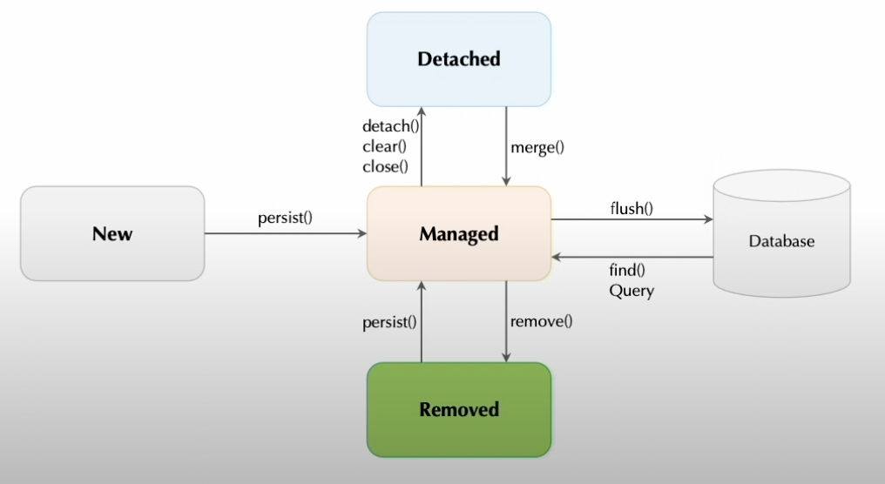

### Entity Lifecycle
- 영속 객체의 상태
  1. 비영속(New): 영속성 컨텍스트로 관리되기 이전 순수 객체 상태
  2. 영속(Managed): 영속성 컨텍스트로 등록되고 관리되는 상태
  3. 준영속(Detached): 영속성 컨텍스트의 관리에 있다가 분리된 상태(Managed -> Detached)
  4. 삭제(Removed): 영속 데이터의 삭제를 위한 상태(EntityManager.remove())

  

- @Entity
  - 도메인 객체를 관계형 데이터베이스 테이블로 맵핑할 때 @Entity 어노테이션을 사용한다.
  - @Entity 어노테이션만 선언했을 때 테이블 이름은 클래스 이름이 되고 대/소문자 치환은 일어나지 않는다.
  - 대부분 RDBMS는 대/소문자를 가리지 않으므로 기본 JPA 작명규칙이 문제를 발생하지는 않는다.
  - @Table 어노테이션을 사용해서 테이블 이름를 명시적으로 표기할 수 있다.
  - 관습적인 테이블 설계 방법에서 테이블 이름은 대문자에 "_" 를 많이 사용한다.
  
  - @Access
    - JPA에서 객체에 대한 접근방식은 크게 필드 접근방법과 프로퍼티 접근방법(setter/getter)으로 구분한다.
    - @Access를 적용하지 않을 경우 @Id 어노테이션의 지정 위치에 따라 접근 방법을 결정할 수 있다.
    - @Access 어노테이션을 선언해서 명시적으로 접근 방법을 설정할 수 있다.
    - @Access 어노테이션으로 필드/속성 접근 방법을 동시에 사용할 수도 있다.